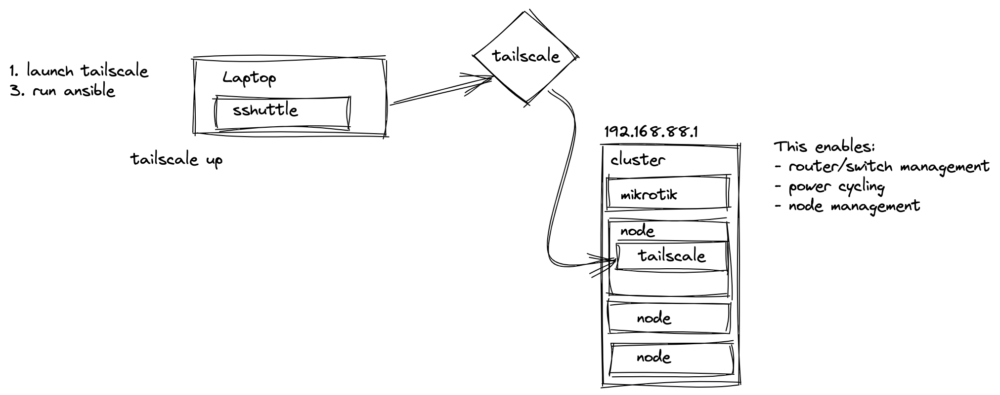

## Management with tailscale




### Node management

```
ansible all -i inventory -m shell -a 'shutdown -r now'
```
```
ansible all -i inventory -m shell -a 'vcgencmd measure_temp'
```

### Switch management

_print poe status_
```
ansible leader -i inventory -m shell -a 'ssh -t admin@192.168.88.1 "interface ethernet poe print;quit"'
```
_poe off_
```
 ansible leader -i inventory -m shell -a 'ssh -t admin@192.168.88.1 "interface ethernet poe set ether5 poe-out=off;quit"'
```
_poe on_
```
ansible leader -i inventory -m shell -a 'ssh -t admin@192.168.88.1 "interface ethernet poe set ether5 poe-out=auto-on;quit"
```
